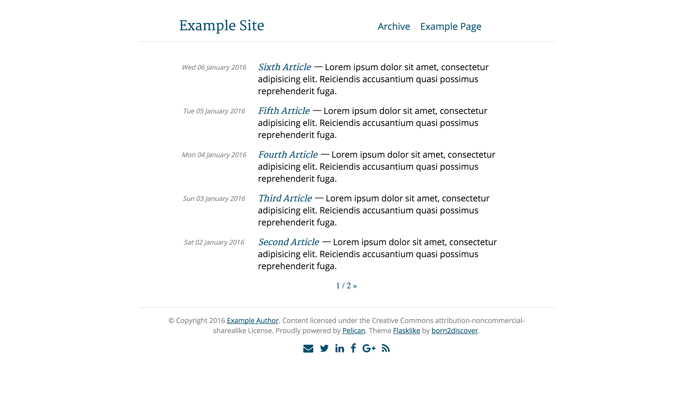
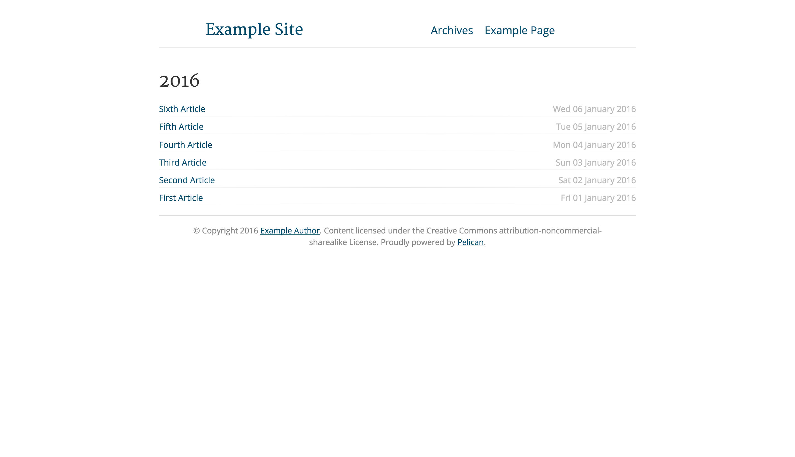

# Pelican-flasklike

A pelican template inspired by [Flask](http://flask.pocoo.org/) website, [Armin Ronacher's blog](http://lucumr.pocoo.org/) and [flasky](https://github.com/fjavieralba/flasky) by [Javier Alba](https://github.com/fjavieralba). Feel free to add and also tweak it and add more features to it as it is released under MIT licence.

## Configuration

In order to correctly use this theme, you'll need your `pelicanconf.py` file to look like this:

```python
#!/usr/bin/env python
# -*- coding: utf-8 -*- #
from __future__ import unicode_literals

AUTHOR = 'Example Author'
SITENAME = 'ExampleSite'
SITEURL = ''
PATH = 'content'
TIMEZONE = 'Europe/Berlin'
DEFAULT_LANG = 'en'

# Feed generation is usually not desired when developing
FEED_ALL_ATOM = None
CATEGORY_FEED_ATOM = None
TRANSLATION_FEED_ATOM = None
AUTHOR_FEED_ATOM = None
AUTHOR_FEED_RSS = None
DEFAULT_PAGINATION = 5

# Uncomment following line if you want document-relative URLs when developing
#RELATIVE_URLS = True

TYPOGRIFY = True
THEME = 'pelican-flasklike'
DEFAULT_DATE_FORMAT = '%d %B %Y'
DISPLAY_PAGES_ON_MENU = True


ARTICLE_URL = 'posts/{date:%Y}/{date:%m}/{date:%d}/{slug}/'
ARTICLE_SAVE_AS = 'posts/{date:%Y}/{date:%m}/{date:%d}/{slug}/index.html'
PAGE_URL = '{slug}/'
PAGE_SAVE_AS = '{slug}/index.html'
YEAR_ARCHIVE_SAVE_AS = 'posts/{date:%Y}/index.html'
MONTH_ARCHIVE_SAVE_AS = 'posts/{date:%Y}/{date:%m}/index.html'
ARCHIVES_SAVE_AS = 'archives/index.html'
DELETE_OUTPUT_DIRECTORY = True

# Template specific
MENUITEMS = (
    ('Archive', SITEURL + '/archives/'),
)
LICENCE = 'Content licensed under the Creative Commons attribution-noncommercial-sharealike License.'

# Social Links
EMAIL = None
TWITTER_USERNAME = None # Twitter without the @
LINKEDIN_URL = None
FACEBOOK_URL = None
GOOGLEPLUS_URL = None

TWITTER_CARDS = True
FACEBOOK_OPEN_GRAPH = True
GOOGLE_ANALYTICS_ACCOUNT = None # Can be a string like: 'UA-00000000-1'
PIWIK_URL =  None # Can be a string like: 'myurl.com/piwik'
PIWIK_SSL_URL = None # Can be a string like: 'myurl.com/piwik'
PIWIK_SITE_ID = None # Can be a string like: '1'
```
## Instalation instructions
```shell
cd directory_where_you_initiated_pelican
git clone git@github.com:born2discover/pelican-flasklike.git
```

Then simply edited your `pelicanconf.py` to point to that directory.

```python
THEME='pelican-flasklike'
# OR
THEME='/absolute/path/to/pelican-flasklike'
```

## Additional pieces of information
[Pelican Documentation](http://docs.getpelican.com/en/3.6.3/)




